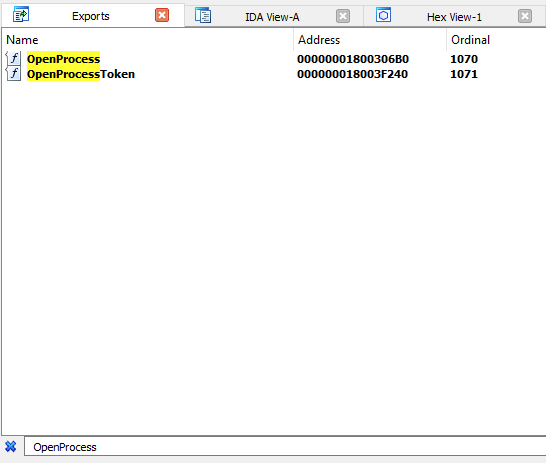
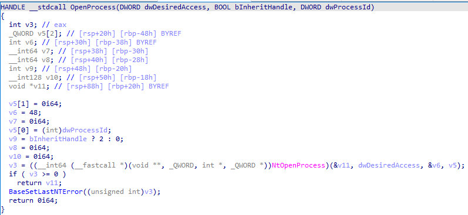
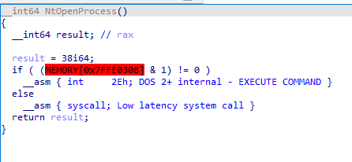

# Lab 1 - Analyzing OpenProcess

## Lab Objectives
* Understand the OpenProcess Win32 API and all of it's parameters
* Understand how to track the OpenProcess API to lower level calls to identify the callstack 

## Source Code: 
[Sample 3](../../../Sample%203/src/Source.cpp)

## Part 1: Understand the OpenProcess call and it's parameters

After creating the function call graph we see that one of the calls that are made is a call to OpenProcess on line 19: 
```
hProcess = OpenProcess(PROCESS_QUERY_LIMITED_INFORMATION, true, PID);
```
OpenProcess accepts 3 input parameters: 
1. A DWORD value that represents the desired access the callee wants to a target process
2. A BOOL value that represents whether a child process should inherit the returned handle, if TRUE it will if FALSE it won't
3. A DWORD value that represents the process id of the target process

If access to the target process is obtained then a return value of a HANDLE is returned. This handle can be used to perform actions on the target process, but those actions are limited based on the access they were granted. 

In the example above the following parameters were inputed: 

1. PROCESS_QUERY_LIMITED_INFORMATION (0x1000)
2. TRUE
3. PID value that is obtained as an argument from the main function here - `DWORD PID = atoi(argv[1]);`

## Part 2: Identify the callstack 

Microsoft is kind enough to show us where the OpenProcess API is exported - kernel32.dll. 

#### Step 1: Open up kernel32.dll in IDA as Administrator

#### Step 2: Go to the `Functions` tab and look for `OpenProcess`: 
    

You will notice there is actually no OpenProcess function but `OpenProcessStub`. When double clicking on the `OpenProcessStub` function we can see there is a jmp to a `_imp_OpenProcess`:
    

This means tat OpenProcessStub makes an immediate call to an imported function `OpenProcess`. To determine where this function is exported we need to look at the `Imports` tab.

#### Step 3: Go to the `Imports` tab and look for `OpenProcess`:
    

We can see that the OpenProcess function is exported through an API set - `api-ms-win-core-processthreads-l1-1-1`. [API sets](https://learn.microsoft.com/en-us/windows/win32/apiindex/windows-apisets) are a way that Microsoft organized Win32 APIs into functional groups. API sets load the appropriate DLL that exports a functions. To find the appropriate DLL we will use NtObjectManager, a PowerShell module created by James Forshaw. 

#### Step 4: Open PowerShell as Administrator and import NtObjectManager by running the following command:
```
Import-Module NtObjectManager
```


#### Step 5: Leverage the Get-NtApiSet in NtObjectManager to find the OpenProcess call: 
```
Get-NtApiSet -Name api-ms-win-core-processthreads-l1-1-1 | select -ExpandProperty Hosts
```


This is stating that if this API set is referenced (`api-ms-win-core-processthreads-l1-1-1`) then forward to `kernel32.dll`, but if the DLL that is refernecing that API set is kernel32.dll then forward to `kernelbase.dll`.

#### Step 6: Open up kernelbase.dll in IDA and go to the Exports tab and search for OpenProcess


#### Step 7: Double click on OpenProcess and analyze the functions
When you get to the function you will initially see it is is the disassembly view, press F5 to see the decompiled view, like this: 



We can see that the function OpenProcess is relatively short and eventually makes a call to another function `NtOpenProcess`. We know this is related to the function flow because we can see that the parameters from OpenProcess. 

Double click on NtOpenProcess, you will notice that this shows the following: `extrn __imp_NtOpenProcess:qword`. This means that NtOpenProcess is imported. 

#### Step 8: Go to the Imports tab and find where NtOpenProcess is imported from

We can see that `NtOpenProcess` is imported from ntdll.dll. 


#### Step 9: Open ntdll.dll in IDA

#### Step 10: Find the NtOpenProcess function in the Functions window


#### Step 11: Analyze NtOpenProcess 
By double clicking on the NtOpenProcess function we are met with a disassembly view of the function. Press F5 to switch to the decompilation view. 



We can see that this function is very short. That is because this function essentially ends up making a syscall into the kernel. We know that because we see the following: 
```
__int64 result; // rax

  result = 38i64;
  if ( (MEMORY[0x7FFE0308] & 1) != 0 )
    __asm { int     2Eh; DOS 2+ internal - EXECUTE COMMAND }
  else
    __asm { syscall; Low latency system call }
  return result;
``` 
Which makes a call to 21h/33. 21h is something known as a system service number that passes through the system service dispatcher and passes it to the system service dispatch table (SSDT) which looks up which function in the kernel to execute. 

If you wanted to find this without looking at the decompilation, look at the value passed into EAX/RAX in the disassembly view. 

This is where we will end for the analysis, we stop here because kernel calls can be hard to track and don't hold a lot of relevance for the level of analysis we are currently performing. 


## Part 3: Create the function graph

After performing analysis we can identify that when kernel32!OpenProcess is called the function stack will be: 

kernel32!OpenProcess
api-ms-win-core-processthreads-l1-1-1!OpenProcess
kernelbase!OpenProcess
ntdll!OpenProcess
syscall!OpenProcess (we identify syscall here because syscall values can change across OS versions)

Now we want to represent this in a graph format that can be visually pleasant: 

