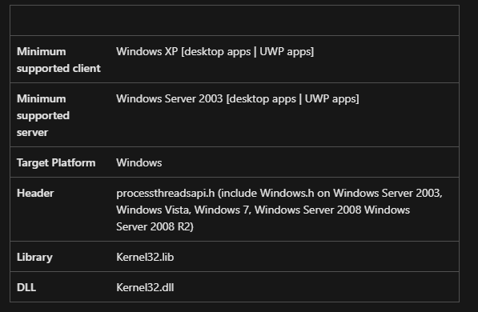
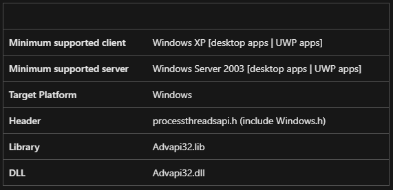
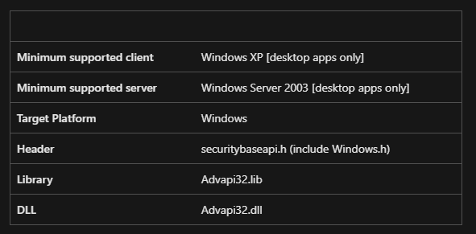

# Lab 1 - Function Flow

## Lab Objectives
* Identify the function flow of the sample
* Have a better understanding for what the code is doing in order to be successful in it's desired action

## Source Code: 
[Sample 3](../../../Sample%203/src/Source.cpp)

## Part 1: Function Identification

The code we are following will start at the main function seen below: 
```
int main(int argc, char* argv[])
{
    DWORD PID = atoi(argv[1]);

    HANDLE hToken, hProcess = NULL;

    hProcess = OpenProcess(PROCESS_QUERY_LIMITED_INFORMATION, true, PID);
    OpenProcessToken(hProcess, TOKEN_DUPLICATE | TOKEN_QUERY, &hToken);
    ImpersonateLoggedOnUser(hToken);
           
    CloseHandle(hToken);
    CloseHandle(hProcess);

    return 0;
}
```

This POC is pretty straight forward as all of the functionality is implemented within the main function.

### Step 1: OpenProcess
Typically the beginning of functions start with initialization, this is important for the functions being implemented to be successful. However; the first thing we do is identify the necessary functions and then track back the parameters that are passed into those to understand their relevance. 

The first function in this example is a call to OpenProess in line 12. 
```
hProcess = OpenProcess(PROCESS_QUERY_LIMITED_INFORMATION, true, PID);
```

To understand why this function is being called, it is important to understand what this POC is doing. It is wanting to take an access token and set it to it's current thread. Well there are 3 securable objects that are involved in that process: 
1. Target Process
2. Target Token
3. Source Thread 

Each one of these securable objects have to be interfaced with and OpenProcess is going to address the first one - accessing the target process. It needs to do so because the access token lives within the process. Lab 2 will walk into OpenProcess and it's parameters more in-depth but this is critical for this code so that it can obtain a handle to the target process it wants to steal the token from. 

We also want to identify which module this is being taken out of so that we know at what level this API is being executed from. Because there are no function pointers or any other indication that this function was loaded outside of its default that is exposed through the header, we can use Microsoft documentation to tell use which DLL this function is exported out of. In [OpenProcess](https://learn.microsoft.com/en-us/windows/win32/api/processthreadsapi/nf-processthreadsapi-openprocess) we can see at the bottom it is exported out of kernel32.dll. 



### Step 2: OpenProcessToken 

After a handle to the process has been obtained a call to OpenProcessToken on line 13 is made: 
```
OpenProcessToken(hProcess, TOKEN_DUPLICATE | TOKEN_QUERY, &hToken);
```

This speaks to the 2nd securable object that needs to be accessed - the target token. OpenProcessToken allows for a callee with a handle to a process to request access to that token and in turn get a handle to it. This is critical for the next call we will see - ImpersonateLoggedOnUser. 

Again, there are no function pointers that would lead us to believe that this function was executed outside of it's default export so we can go to [OpenProcessToken](https://learn.microsoft.com/en-us/windows/win32/api/processthreadsapi/nf-processthreadsapi-openprocesstoken) and see this funciton is exported out of advapi32.dll.



### Step 3: ImpersonateLoggedOnUser
After the handle to a token has been retrieved a call to ImpersonateLoggedOnUser is made on line 14: 
```
ImpersonateLoggedOnUser(hToken);
```

In this lab we won't walk through the purpose of ImpersonateLoggedOnUser as that is dove into a bit in lab 3. However; this can be considered the end of the attack, but not the end of the function flow. That is because ImpersonateLoggedOnUser interacts with the target token and set's it to the current thread the desired action of impersonating a user has been completed. However; it is good to note we shouldn't stop here because there are often post-action functions called whether those are validation checks or cleanup actions. Now these actions might not be useful in detection, but we don't want to limit that capabilitity quite yet. 

There are no function pointers that would lead us to believe that this function was executed outside of it's default export so we can go to [ImpersonateLoggedOnUser](https://learn.microsoft.com/en-us/windows/win32/api/securitybaseapi/nf-securitybaseapi-impersonateloggedonuser) and see this funciton is exported out of advapi32.dll.




### Step 4: CloseHandle(s)
Lastly, 2 calls to CloseHandle are called. This is seen a lot in code that deals with unmanaged code as the memory/handles need to be cleaned up. 

There are no function pointers that would lead us to believe that this function was executed outside of it's default export so we can go to [CloseHandle](https://learn.microsoft.com/en-us/windows/win32/api/handleapi/nf-handleapi-closehandle) and see this funciton is exported out of kernel32.dll.


## Part 2: Create the function graph

Now that we have identified all of the functions in the POC we need to document them and map them out. We might remove some in the future once we have identified if the function was necessary or sufficient for the desired action, but for now we include everything. The following functions were executed: 

* kernel32!OpenProcess
* kernel32!OpenProcessToken
* advapi32!ImpersonateLoggedOnUser
* kernel32!CloseHandle
* kernel32!CloseHandle

Now we want to represent this in a graph format that can be visually pleasant: 


