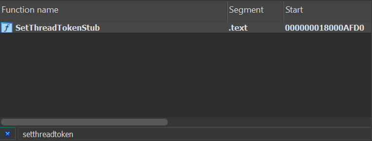
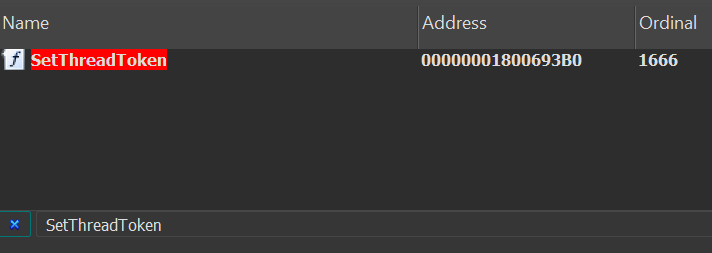
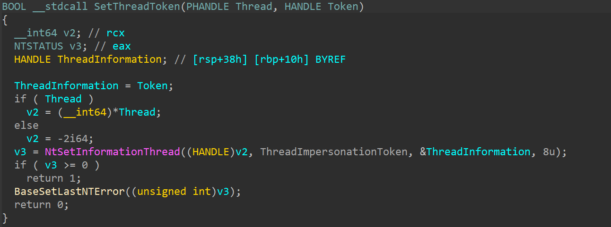

# Lab 2 - Analyzing SetThreadToken

## Lab Objectives
* Understand the SetThreadToken Win32 API and all of it's parameters
* Understand how to track the SetThreadToken API to lower level calls to identify the callstack 

## Source Code: 
[Sample 1](../../../Sample%201/src/Source.cpp)

## Part 1: Understand the SetThreadToken call and it's parameters

After creating the function call graph we see that one of the calls that are made is a call to SetThreadToken on line 15: 
```
SetThreadToken(NULL, hDuplicate);
```
SetThreadToken accepts 2 input parameters: 
1. A pointer to a thread handle that the token will be set to. 
2. A HANDLE value that holds the token that will be set to the thread above.

In the example above the following parameters were inputed: 

1. NULL which means that the token will be set to the callee thread
2. A handle to an impersonation token which was created via DuplicateHandle

## Part 2: Identify the callstack 

Microsoft is kind enough to show us where the SetThreadToken API is exported - advapi32.dll. 

#### Step 1: Open up advapi32.dll in IDA as Administrator

#### Step 2: Go to the `Functions` tab and look for `SetThreadToken`: 



You will notice there is actually no SetThreadToken function but `SetThreadTokenStub`. When double clicking on the `SetThreadTokenStub` function we can see there is a jmp to a `_imp_SetThreadToken`:


    

This means tat SetThreadTokenStub makes an immediate call to an imported function `SetThreadToken`. To determine where this function is exported we need to look at the `Imports` tab.

#### Step 3: Go to the `Imports` tab and look for `SetThreadToken`:


We can see that the SetThreadToken function is exported through an API set - `api-ms-win-core-processthreads-l1-1-0`. [API sets](https://learn.microsoft.com/en-us/windows/win32/apiindex/windows-apisets) are a way that Microsoft organized Win32 APIs into functional groups. API sets load the appropriate DLL that exports a functions. To find the appropriate DLL we will use NtObjectManager, a PowerShell module created by James Forshaw. 

#### Step 4: Open PowerShell as Administrator and import NtObjectManager by running the following command:
```
Import-Module NtObjectManager
```


#### Step 5: Leverage the Get-NtApiSet in NtObjectManager to find the SetThreadToken call: 
```
Get-NtApiSet -Name api-ms-win-core-processthreads-l1-1-0 | select -ExpandProperty Hosts
```


This is stating that if this API set is referenced (`api-ms-win-core-processthreads-l1-1-0`) then forward to `kernel32.dll`, but if the DLL that is refernecing that API set is kernel32.dll then forward to `kernelbase.dll`.

#### Step 6: Open up kernelbase.dll in IDA and go to the Exports tab and search for SetThreadToken



#### Step 7: Double click on SetThreadToken and analyze the functions
When you get to the function you will initially see it is is the disassembly view, press F5 to see the decompiled view, like this: 



We can see that the function SetThreadToken is relatively short and eventually makes a call to another function `NtSetInformationThread`. We know this is related to the function flow because we can see that the parameters from SetThreadToken. 

Double click on NtSetInformationThread, you will notice that this shows the following: `extrn __imp_NtSetInformationThread:qword`. This means that NtSetInformationThread is imported. 

#### Step 8: Go to the Imports tab and find where NtSetInformationThread is imported from

We can see that `NtSetInformationThread` is imported from ntdll.dll. 


#### Step 9: Open ntdll.dll in IDA

#### Step 10: Find the NtSetInformationThread function in the Functions window


#### Step 11: Analyze NtSetInformationThread 
By double clicking on the NtSetInformationThread function we are met with a disassembly view of the function. Press F5 to switch to the decompilation view. 


We can see that this function is very short. That is because this function essentially ends up making a syscall into the kernel. We know that because we see the following: 
```
NTSTATUS result; // eax

  result = 13;
  if ( (MEMORY[0x7FFE0308] & 1) != 0 )
    __asm { int     2Eh; DOS 2+ internal - EXECUTE COMMAND }
  else
    __asm { syscall; Low latency system call }
  return result;
``` 
Which makes a call to 0Dh/13. 21h is something known as a system service number that passes through the system service dispatcher and passes it to the system service dispatch table (SSDT) which looks up which function in the kernel to execute. 

If you wanted to find this without looking at the decompilation, look at the value passed into EAX/RAX in the disassembly view. 

This is where we will end for the analysis, we stop here because kernel calls can be hard to track and don't hold a lot of relevance for the level of analysis we are currently performing. 


## Part 3: Create the function graph

After performing analysis we can identify that when advapi32!SetThreadToken is called the function stack will be: 

advapi32!SetThreadToken 
api-ms-win-core-processthreads-l1-1-0!SetThreadToken
kernelbase!SetThreadToken
ntdll!NtSetInformationThread
syscall!NtSetInformationThread (we identify syscall here because syscall values can change across OS versions)

Now we want to represent this in a graph format that can be visually pleasant: 


