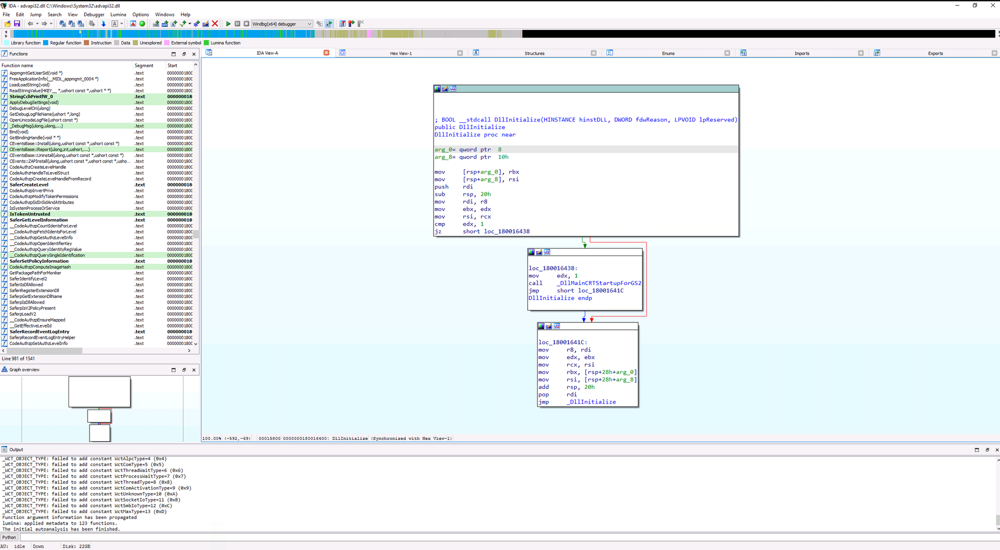
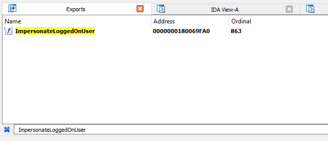
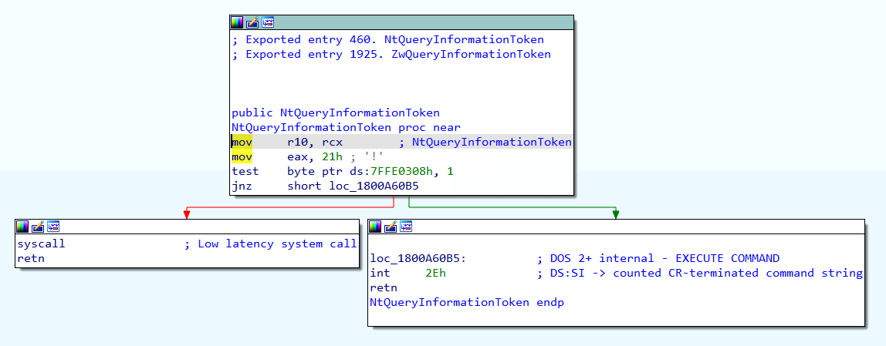
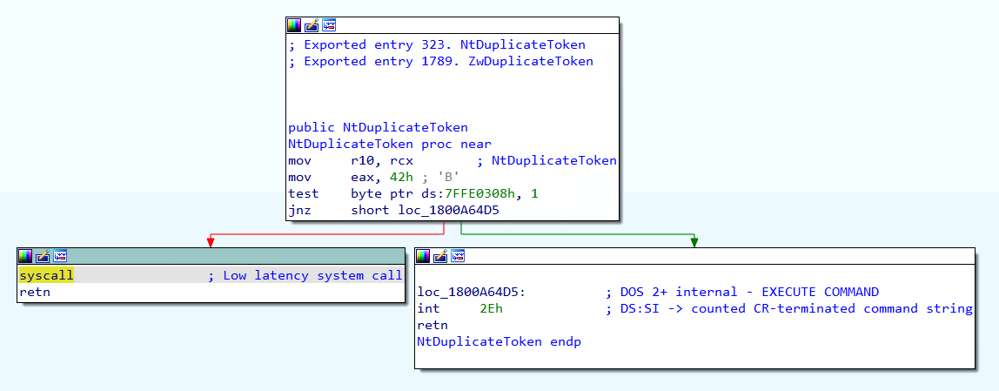

# Lab 3 - Analyzing ImpersonateLoggedOnUser

## Lab Objectives
* Understand the ImpersonateLoggedOnUser Win32 API and all of it's parameters
* Understand how to track the ImpersonateLoggedOnUser API to lower level calls to identify the callstack 
* Understand what compound functions are

## Source Code: 
[Sample 3](../../../Sample%203/src/Source.cpp)

## Part 1: Understand the ImpersonateLoggedOnUser call and it's parameters
After creating the function call graph we see that the last function called is the ImpersonateLoggedOnUser function. ImpersonateLoggedOnUser is unique as it is a compound function, meaning that it wraps a bunch of capability under the hood. Let's look at how ImpersonateLoggedOnUser is implemented in the tool we are analyzing. We can see that on line 32 ImpersonateLoggedOnUser is called via:
```
ImpersonateLoggedOnUser(hToken)
```
OpenProcess accepts 1 input parameter: 
1. A HANDLE value to a token. This token is going to be set to the current thread that is being executed.

If the token is set properly then the return value is going to return TRUE which is a BOOL value. Now let's take a look at the callstack to understand how ImpersonateLoggedOnUser is setting the token to the current thread. 

## Part 2: Identify the callstack 

Microsoft is kind enough to show us where the ImpersonateLoggedOnUser API is exported - advapi32.dll. 

#### Step 1: Open up advapi32.dll in IDA as Administrator



#### Step 2: Go to the `Functions` tab and look for `ImpersonateLoggedOnUser` and double click on it 

You will notice there is actually no ImpersonateLoggedOnUser function but `ImpersonateLoggedOnUserStub`. When double clicking on the `ImpersonateLoggedOnUserStub` function we can see there is a jmp to a `_imp_ImpersonateLoggedOnUser`:


This means tat ImpersonateLoggedOnUserStub makes an immediate call to an imported function `ImpersonateLoggedOnUser`. To determine where this function is exported we need to look at the `Imports` tab.

#### Step 3: Go to the `Imports` tab and look for `ImpersonateLoggedOnUser`:


We can see that the OpenProcess function is exported through an API set - `api-ms-win-security-base-l1-1-0`. [API sets](https://learn.microsoft.com/en-us/windows/win32/apiindex/windows-apisets) are a way that Microsoft organized Win32 APIs into functional groups. API sets load the appropriate DLL that exports a functions. To find the appropriate DLL we will use NtObjectManager, a PowerShell module created by James Forshaw. 

#### Step 4: Open PowerShell as Administrator and import NtObjectManager by running the following command:
```
Import-Module NtObjectManager
```

#### Step 5: Leverage the Get-NtApiSet in NtObjectManager to find the OpenProcess call: 
```
Get-NtApiSet -Name api-ms-win-security-base-l1-1-0 | select -ExpandProperty Hosts
```


This is stating that if this API set is referenced (`api-ms-win-security-base-l1-1-0`) then forward to `kernelbase.dll`.

#### Step 6: Open up kernelbase.dll in IDA and go to the Exports tab and search for ImpersonateLoggedOnUser


#### Step 7: Double click on ImpersonateLoggedOnUser and analyze the functions
When you get to the function you will initially see it is is the disassembly view, press F5 to see the decompiled view, like this: 


We can see that the function ImpersonateLoggedOnUser makes a call to multiple Nt-based functions. This is why we consider ImpersonateLoggedOnUser a compound function, because it doesn't perform a singular task but calls multiple to be successful in impersonating a user. The following functions are called: 
* NtQueryInformationToken
* NtDuplicateToken 
* NtSetInformationThread

By clicking on these functions we can find that they are imported functions from ntdll.dll. 

#### Step 9: Open ntdll.dll in IDA

#### Step 10: Find the NtQueryInformationToken function in the Functions window and analyze it



We see that NtQueryInformationToken ends up making a syscall 21h/33. Here is a look at the decompliation view (press F5 to view this): 
```
  __int64 result; // rax

  result = 33i64;
  if ( (MEMORY[0x7FFE0308] & 1) != 0 )
    __asm { int     2Eh; DOS 2+ internal - EXECUTE COMMAND }
  else
    __asm { syscall; Low latency system call }
  return result;
``` 
**Note:** To know more about syscalls please revisit lab 2. 


#### Step 11: Find the NtDuplicateToken function in the Functions window and analyze it



We see that NtDuplicateToken ends up making a syscall 42h/66. Here is a look at the decompliation view (press F5 to view this): 
```
  __int64 result; // rax

  result = 66i64;
  if ( (MEMORY[0x7FFE0308] & 1) != 0 )
    __asm { int     2Eh; DOS 2+ internal - EXECUTE COMMAND }
  else
    __asm { syscall; Low latency system call }
  return result;
``` 
**Note:** To know more about syscalls please revisit lab 2. 


#### Step 12: Find the NtSetInformationThread function in the Functions window and analyze it


We see that NtSetInformationThread ends up making a syscall 0Dh/13. Here is a look at the decompliation view (press F5 to view this): 
```
  __int64 result; // rax

  result = 13i64;
  if ( (MEMORY[0x7FFE0308] & 1) != 0 )
    __asm { int     2Eh; DOS 2+ internal - EXECUTE COMMAND }
  else
    __asm { syscall; Low latency system call }
  return result;
``` 
**Note:** To know more about syscalls please revisit lab 2. 

This is where we will end for the analysis, we stop here because kernel calls can be hard to track and don't hold a lot of relevance for the level of analysis we are currently performing. 


## Part 3: Create the function graph

After performing analysis we can identify that when kernel32!ImpersonateLoggedOnUser is called the function stack will be: 

* kernel32!ImpersonateLoggedOnUser
* api-ms-win-security-base-l1-1-0!ImpersonateLoggedOnUser
* ntdll!NtQueryInformationToken
* syscall!NtQueryInformationToken
* ntdll!NtDuplicateToken 
* syscall!NtDuplicateToken
* ntdll!NtSetInformationThread
* syscall!NtSetInformationThread

Now we want to represent this in a graph format that can be visually pleasant: 

