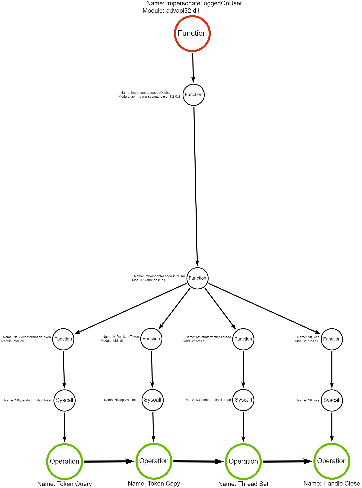

# Lab 4 - Operations

## Lab Objectives
* Obtain a better understanding of operations
* Identify operations for call stacks

## Source Code: 
[Sample 3](../../../Sample%203/src/Source.cpp)

## Part 1: Identify ImpersonateLoggedOnUser's Operations

In lab 3 we walked through the ImpersonateLoggedOnUser function and in doing so we found that ImpersonateLoggedOnUser was a compound function meaning that in order to set a token to the current thread it called a lot of underlying functions. Specifically the following: 

* NtQueryInformationToken
* NtDuplicateToken 
* NtSetInformationThread

Now that we have identified this we need to identify the operations for each call. Ideally this process is replicated across all the functions in the tool graph, but for this lab we will only do ImpersonateLoggedOnUser. 

The reason why we want to identify these operations is becauase there are times that we might run across other functions that perform the same operations and then we can identify operational variations. 

There is an operation naming convention that we follow: 

<securable object> <action>

So for the following functions it would be the following: 
#### NtQueryInformationToken
`Token Query`

#### NtDuplicateToken 
`Token Dupliacte`

#### NtSetInformationThread
`Thread Set`

## Part 2: Add operations to graph

Now that we have identifed the operations we need to document this. Instead of showing you the whole tool graph with operations, we challenge you to fill in the rest of the operations. 

